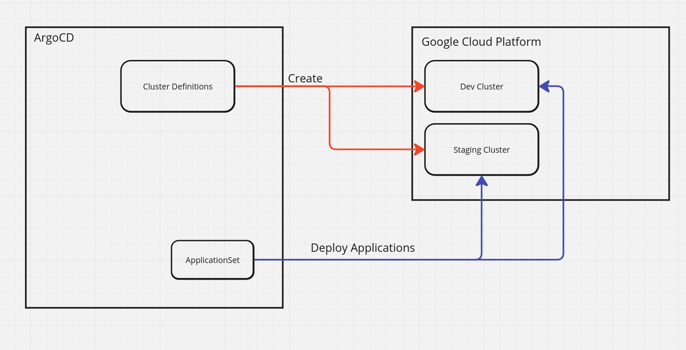

# Bootstrap-Cloud

A disorganised repo that will create minimal GKE clusters using Crossplane then deploy applications on them using ArgoCD (After some manual configuration).

### Diagram

Requirements:

- A GCP account.
- A GCP service account for Crossplane to use.
- ArgoCD CLI

Steps:

1. Change the projectID value to your project in [the core values file](1-core-cluster/core/values.yaml).
1. In `0-terraform-bootstrap`, run `terraform init` then `terraform apply and wait for the bootstrap cluster to roll out.
1. Uncomment the lines in `0-terraform-bootstrap/helm.tf` and run terraform apply again.
1. Enable `gkeClusters` in the [core values file ](1-core-cluster/core/values.yaml).
1. Add some clusters in [the cluster-definitions folder](1-core-cluster/core/cluster-definitions), these will be created by Crossplane.

At this point, Crossplane will pass the cluster credentials back to the ArgoCD namespace as secrets, however they are missing some information and the clusters themselves are missing permissions. This could be automated, however here are the instructions to manually import them for now:

1. Port-forward the ArgoCD server to your local machine, unless you have access via an ingress
1. Login using your credentials, or the admin credentials `argocd login {The address}`
1. Fetch the contexts of the deployed clusters from the gcloud console using `gcloud container clusters get-credentials {Cluster name} --region {region}`
1. Add each context using `argocd add cluster {context name} --name {A short name}`
1. Enable clusterOperators and clusterApplications in [the core values file](core/values.yaml) and ArgoCD will deploy applications on your new GCP clusters.

TODO:

- Automate clusters being added to ArgoCD. This will require:
  - Credentials for ArgoCD to auth to GCP
  - External Secrets Operator to fetch the existing secret and restructure it to what Argo needs
- Split the terraform into two projects so you don't have to manage the Kubernetes provider separately
- Figure out workload identity + permissions from terraform
- Crossplane providers depend on Controller configs, which cannot be created until the provider downloads the CRDs. Added a duff provider in the meantime but this is a circular dependency
